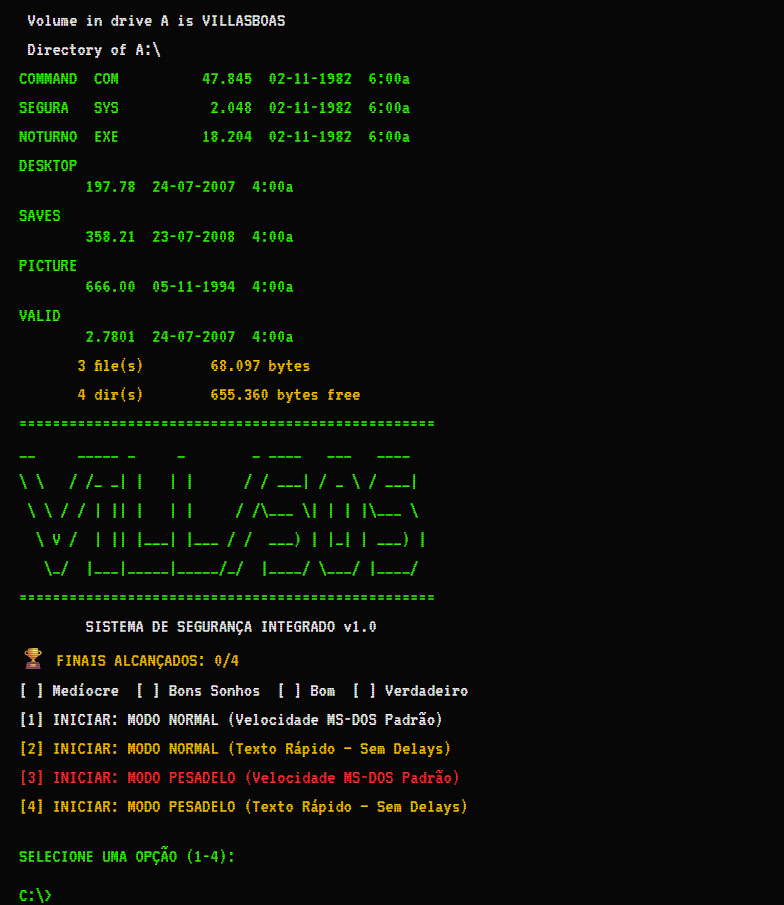

# 🔦 Sistema de Segurança Villas-Boas (1982)

Uma aventura em texto interativa (Text Adventure / IF) de terror e sobrevivência. Sobreviva à noite em um restaurante abandonado gerenciando recursos, resolvendo puzzles e fugindo de ameaças no escuro.

O projeto possui uma **Engine Própria** construída do zero em Python, suportando tanto uma experiência imersiva via **Terminal (CLI)** quanto uma **Web App (Full Stack)** com interface gráfica retrô.

---

![Villas-Boas Interface] 


## ✨ Features Técnicas (Arquitetura & Engenharia)

Este projeto foi construído focando em boas práticas de mercado, arquitetura escalável e Clean Code:

* **UI Agnostic (Injeção de Dependência):** A lógica de jogo é totalmente separada da camada de apresentação. O motor roda via Terminal (`main.py`) ou via Servidor Web (`app.py`) usando adaptadores abstratos (`UIHandler`).
* **Parser Inteligente & Fuzzy Matching:** Implementação de `shlex` para leitura de strings com aspas e `difflib` (Best Match fallback) para tolerância a erros de digitação. O jogador pode digitar `p "chave da cozinha"` ou `pegar xave` e o sistema entende.
* **State Management Estrito:** Validação de tipos rigorosa utilizando **Pydantic** (`BaseModel`), substituindo dataclasses primitivas para garantir consistência em Save/Loads.
* **Prevenção de Memory Leak:** Sessões da aplicação Web são gerenciadas no disco (Persistent Store em `.json`) via `uuid`, garantindo que o servidor Flask possa escalar sem vazar memória RAM.
* **UX/Acessibilidade Web:** Efeito visual CRT em CSS, responsividade Mobile-first, spinners assíncronos para feedback de rede, e tags invisíveis de acessibilidade estrutural para leitores de tela (`[PERIGO]`, `[ATENÇÃO]`).
* **Sistema de Autosave:** O progresso do jogador é serializado de forma invisível a cada turno, unificando a experiência de salvamento entre CLI e Web.

---

## 🛠️ Tecnologias Utilizadas

* **Backend:** Python 3.10+
* **Web Framework:** Flask, Flask-CORS
* **Validação de Dados:** Pydantic
* **Frontend:** HTML5, CSS3 (Vanilla), JavaScript ES6+ (Fetch API / Promises)
* **Testes:** Pytest

---

## 🚀 Instalação e Execução Local

1. **Clone o repositório:**
```bash
git clone [https://github.com/SEU-USUARIO/villas-boas-1982.git](https://github.com/SEU-USUARIO/villas-boas-1982.git)
cd villas-boas-1982

Crie e ative o ambiente virtual:

python3 -m venv venv
# No Linux/Mac:
source venv/bin/activate
# No Windows:
venv\Scripts\activate

Instale as dependências:
pip install -r requirements.txt

Variáveis de Ambiente (Segurança):
export FLASK_SECRET_KEY="sua_chave_super_secreta_aqui"

Execute a API/Servidor Web:
python app.py

(Opcional) Jogue pelo Terminal:
python main.py

## 📡 API Reference

A aplicação utiliza uma API RESTful *stateless*. O estado é recuperado em cada requisição via Session ID (`sid`) alocado em cookies de HTTPOnly.

### 1. Iniciar Sessão
Cria uma nova sessão isolada, reseta o GameState e devolve a tela de Boot.

- **URL:** `/iniciar`
- **Method:** `GET`
- **Success Response (200 OK):**
  ```json
  {
    "estado": {
      "hp": "...",
      "inventario": [],
      "luz": "...",
      "saidas": [],
      "sala": "BOOT"
    },
    "linhas": [
      "<span class=\"verde\">@@TYPE@@verde@@15@@CARREGANDO 'COMMAND.COM'...... OK</span>"
    ]
  }

2. Processar Ação
Envia um comando textual para o Engine de processamento e devolve o estado resultante e as falas renderizadas.

URL: /comando

Method: POST

Headers: Content-Type: application/json

Body: { "comando": "ir corredor" }

Success Response (200 OK): {
  "estado": {
    "hp": 3,
    "inventario": ["lanterna", "chave dos fundos"],
    "luz": 8,
    "saidas": ["Entrada", "Sala 01", "Cozinha Privada"],
    "sala": "CORREDOR"
  },
  "linhas": [
    "<span class=\"verde\">@@TYPE@@verde@@15@@📍 VOCÊ ESTÁ EM: CORREDOR</span>",
    "<span class=\"branco\">@@TYPE@@branco@@15@@👁️  Visão: Um corredor longo com portas numeradas.</span>"
  ]
}

Error Responses:

400 Bad Request: JSON malformado ou payload vazio.

500 Internal Server Error: Exceção não tratada no engine.py. A UI injeta a string [ERRO INTERNO] no array de linhas. Traces são omitidos em produção.